# 4-stage RISC-V Core

# Table of Contents
  - [Introduction To RISC-V ISA](#Introduction-to-risc-v-isa)
  - [Compiler Toolchain](#compiler-toolchain)
  - [Application Binary Interface](#application-binary-interface)
  - [RTL Design Using TL-Verilog and MakerChip](#rtl-design-using-tl-verilog-and-makerchip)
      - [Designing a Simple Calculator](#designing-a-simple-calculator)
      - [Pipelining the Calculator](#pipelining-the-calculator)
      - [Adding Validity to Calculator](#adding-validity-to-calculator)
  - [Basic RISC-V Core](#basic-risc-v-core)
      - [Program Counter and Instruction Fetch](#program-counter-and-instruction-fetch)
      - [Instruction Decode and Read Register File](#instruction-decode-and-read-register-file)
      - [Execute Instruction and Write Register File](#execute-instruction-and-write-register-file)
  - [Pipelined RISC-V Core](#pipelined-risc-v-core)
  - [Final 4-Stage RISC-V Core](#final-4-stage-risc-v-core)
  - [Future Work](#future-work)
  - [References](#references)
  - [Acknowledgement](#acknowledgement)

# Introduction To RISC-V ISA
RISC-V is a new ISA that's available under open, free and non-restrictive licences. RISC-V ISA delivers a new level of free, extensible software and hardware freedom on architecture.

  ## Why RISC-V?
  - Far simple and smaller than commercial ISAs.
  - Avoids micro-architecture or technology dependent features.
  - Small standard base ISA.
  - Multiple Standard Extensions.
  - Variable-length instruction encoding

  For more information about [RISC-V ISA](https://github.com/riscv/riscv-isa-manual)
 
# Compiler Toolchain
Toolchain simply is a set of tools used to compile a piece of code to produce a executable program. Similar to other ISAs RISC-V also has its own toolchain. 
Mentioned below are steps to use RISC-V toolchain

  ### Using RISC-V Complier:
    riscv64-unknown-elf-gcc -<compiler options> -mabi=<ABI options> -march=<Architecture options> -o <object filename> <C Program filename>
  - \<compiler options\>    : O1, Ofast
  - \<ABI options\>         : lp64, lp32
  - \<Architecture options\>: RV64, RV32
  
  ### Viewing the assembly language code:
    riscv64-unknown-elf-objdump -d <object filename>
  
  ### Simulating the object file using SPIKE simulator:
    spike pk <object filename>
    
  ### Debugging the object file using SPIKE:
    spike -d pk <object Filename>

Below images show the toolchain implementaion for a small c program for sum of first 9 positive integers.
  1. RISC-V Toolchain: Compilation, Simulation and Debugging
      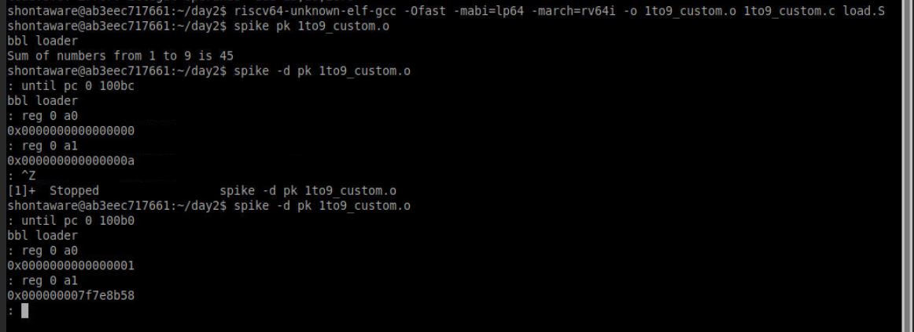
      
  2. Viewing the assembly language code for generated object file.
      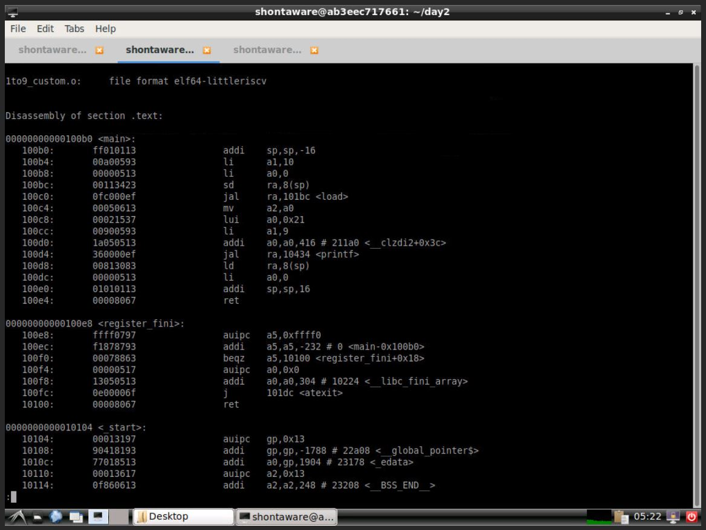

# Application Binary Interface
Every application program runs in a particular environment, which "Application Execution Environment". How the application interfaces with the underlying execution environment is called the "Application Binary Interface (ABI)". 

The Application Binary Interface is the sum total of what the application programmer needs to understand in order to write programs; the programmer does not have to understand or know what is going on within the Application Execution Environment.

An Application Binary Interface would combine the processor ISA along with the OS system-call interface. The below images gives the list of registers, thier short description and ABI name of every register in RISC-V ISA.
 
   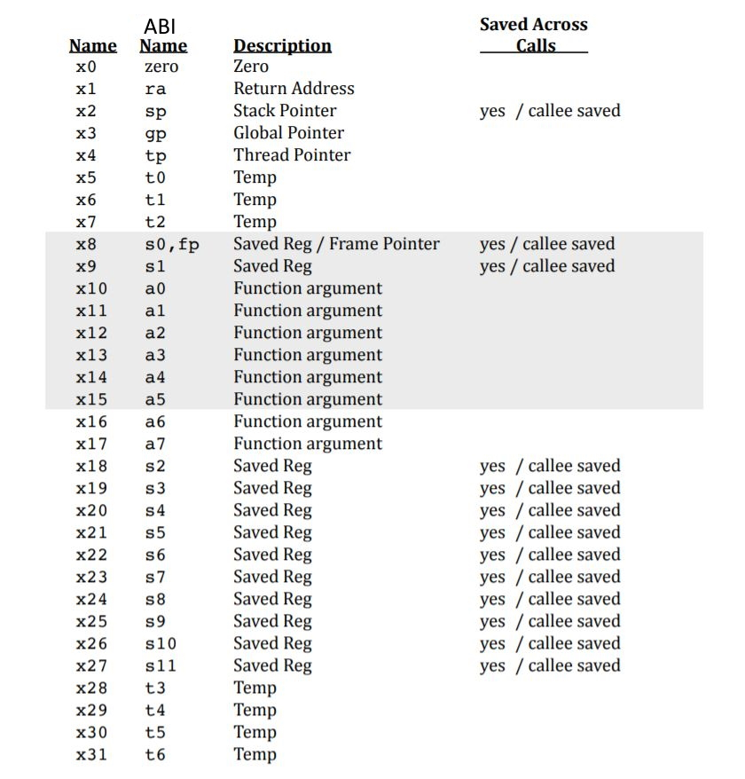

# RTL Design Using TL-Verilog and MakerChip
[Makerchip](http://makerchip.com/) is a free online environment for developing high-quality integrated circuits. You can code, compile, simulate, and debug Verilog designs, all from your browser. Your code, block diagrams, and waveforms are tightly integrated.

Following are some unique features of TL-Verilog :
  - Supports "Timing Abstraction"
  - Easy Pipelining
  - TL-Verilog removes the need always blocks, flip-flops.
  - Compiler available converts TL-Verilog to Verilog, which can be easily synthesized.

    

  ## Designing a Simple Calculator
  A simple implementation of a single stage basic calculator is done in TL-Verilog. The calculator will have two 32-bit input data and one 3-bit opcode. Depending upon the opcode value, calculator operation is selected.
  
  The below snippet shows the implementation in MakerChip. Here all the working of the calculator is done in a single stage.
  
  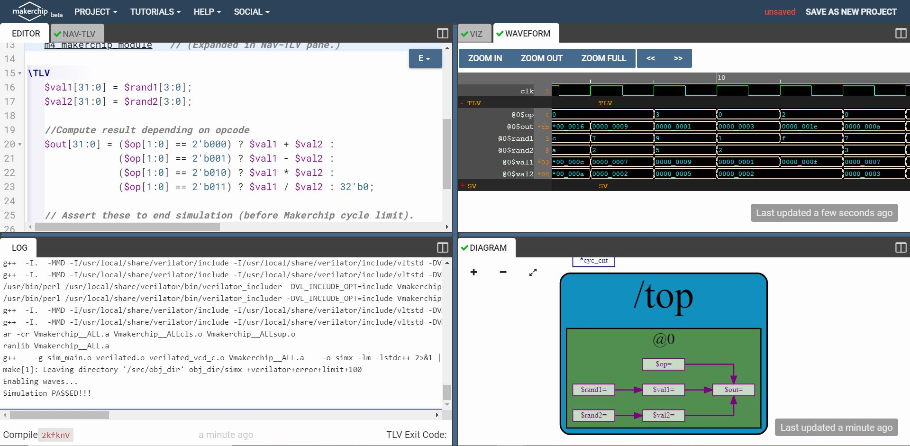
    
  ## Pipelining the Calculator
  The simple calculator developed above is pipelined using TL-Verilog. It seems very easy in TL-Verilog. No need of `always_ff @ (clk)` or any flip-flops, the pipelining can be done just by using `|calc` for defining pipiline and `@1` or `@2` for writing stages of pipeline. 
  
  The below snippet shows that in the pipeline Stage-1 is used for accepting inputs and Stage-2 for arithmetic operations.
    
  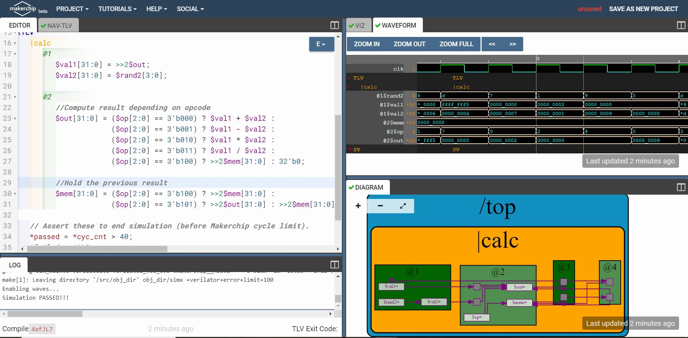
    
  ## Adding Validity to Calculator
  TL-Verilog supports a very unique feature called `validity`. Using validity, we can define tha condition when a specific signal will hold a valid content. The validity conditions is written using `?$valid_variable_name`.
  
  The below snippet shows the implementation of validity. The calculator operation will only be carried out when there is no reset and it is a valid cycle.
  
   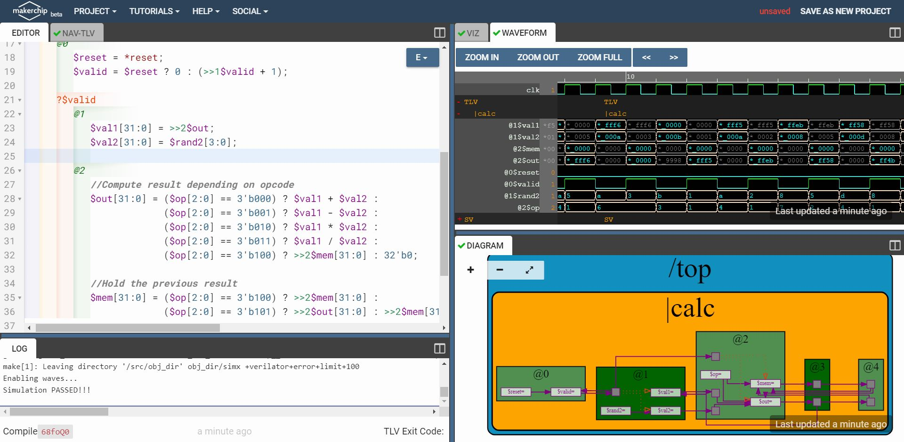
   
   The detailed TL-Verilog code for the calculator can be found [here](Day3_5/calculator_solutions.tlv) 

# Basic RISC-V Core
  This section will cover the implementation of a simple 3-stage RISC-V Core / CPU. The 3-stages broadly are: Fetch, Decode and Execute.
  The diagram below is the basic block of the CPU core.
  
   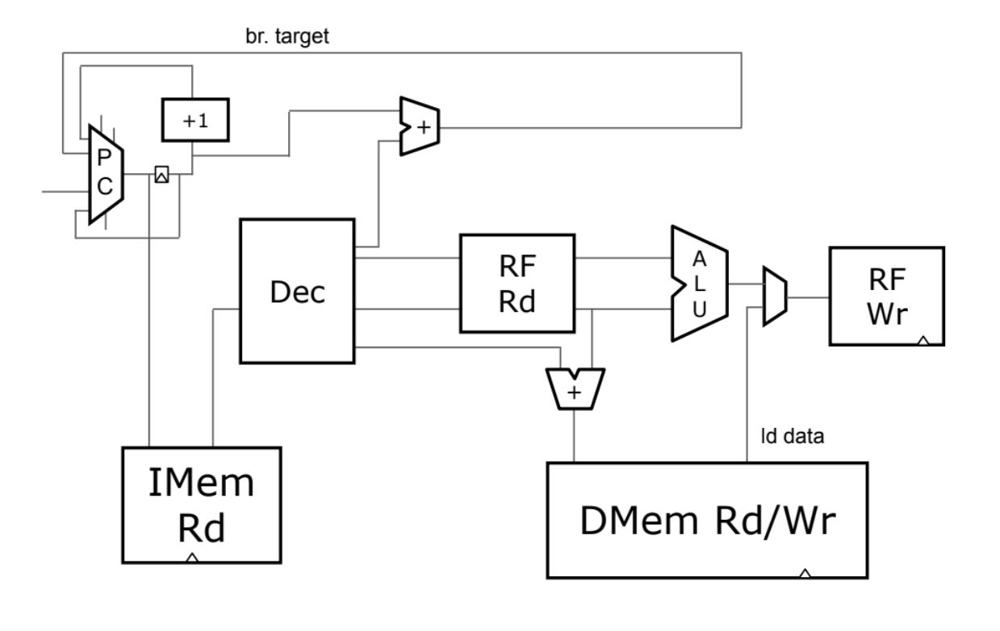
   
   ## Program Counter and Instruction Fetch
   Program Counter, also called as Instruction Pointer is a block which contains the address of the next instruction to be executed. It is feed to the instruction memory, which in turn gives out the instruction to be executed. The program counter is incremented by 4, every valid interation.
   The output of the program counter is used for fetching an instruction from the instruction memory. The instruction memory gives out a 32-bit instruction depending upon the inout address.
   The below snippet shows the Program Counter and Instruction Fetch Implementation in Makerchip.
   
   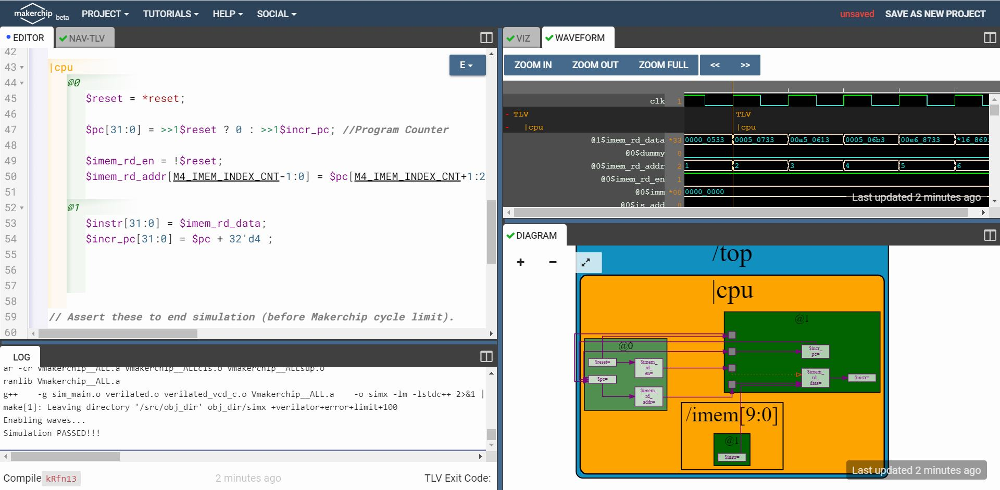
   
   ## Instruction Decode and Read Register File
   The 32-bit fetched instruction has to be deocded first to determine the operation to be performed and the source / destination address. Instrcution Type is first identified on the opcode bits of instruction. The instruction type can R, I, S, B, U, J.
   Every instruction has a fixed format defined in the RISC-V ISA. Depending on the formats, the following fields are determined:
   - `opcode`, `funct3`, `funct7` -> Specifies the Operation
   - `imm` -> Immediate values / Offsets
   - `rs1`, `rs2` -> Source register index
   - `rd` -> Destination regsiter index
   
   Generally, RISC-V ISA provides 32 Register each of width = `XLEN` (for example, XLEN = 32 for RV32) 
   Here, the regsiter file used allows 2 - reads and 1 - write simultaneously.
   
   The below snippet shows the Decode and Read Register Implementation in Makerchip.
   
   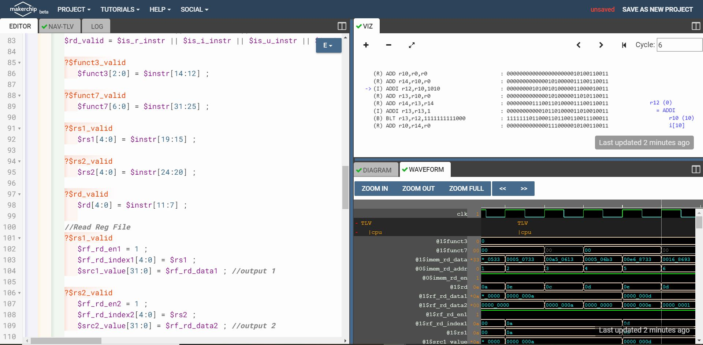
   
   ## Execute Instruction and Write Register File
   Depending upon the decoded operation, the instruction is executed. Arithmetic and Logical Unit (ALU) used if required. If the instruction is a branching instruction the target branch address is computed separately.
   After the instruction is executed, the result of stored back to the Register File, depending upon the destination register index.
   The below snippet shows the Instruction Execute and Write Register File Implementation in Makerchip.
   
   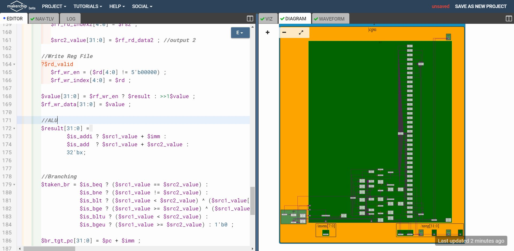

The code for the 3-stage simple RISC-V Core can be found [here](Day3_5/riscv_core_without_pipelining.tlv)

# Pipelined RISC-V Core
  Pipelining processes increases the overall performance of the system. Thus, the previously designed cores can be pipelined. The "Timing Abstraction" feature of TL-Verilog makes it easy.
  
  ## Pipelining the Core
  Pipelining in TL-Verilog can be done in following way:
  
    |<pipe_name>
    @<pipe_stage>
       Instructions present in this stage
    @<pipe_stage>
       Instructions present in this stage
  
  The are various hazards to be taken into consideration while implementing a pipelined design. Some of hazards taken under consideration are:
   - Improper Updation of Program Counter (PC)
   - Read-before-Write Hazard
   
  ## Load and Store Data
  A Data memory can be added to the Core. The Load-Store operations will add up a new stage to the core. Thus making it now a 4-Stage Core / CPU.
  
  The proper functioning of the RISC-V core can ensured by introducing some testcases to the code. 
  For example, if program for summation of positive integers from 1 to 9 and storing it to specific register can be verified by:
  
      *passed = |cpu/xreg[17]>>5$value == (1+2+3+4+5+6+7+8+9);
      
   Here, `xreg[17]` is the register holding the final result.
   
# Final 4-Stage RISC-V Core
  After pipelining is proved in simulations, the operations for Jump Instructions are added. Also, added Instruction Decode and ALU Implementation for RV32I Base Integer Instruction Set.
  
  The snippet below shows the successful implementation of 4-stage RISC-V Core
  
  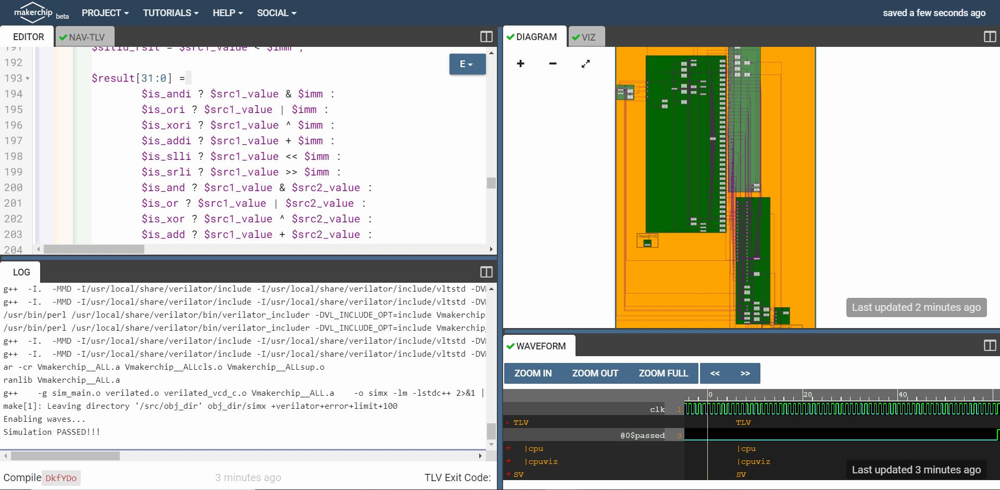
  
  The complete TL-Verilog code for 4-Stage RISC-V Core can be found [here](Day3_5/risc-v_solutions.tlv) 
  
  ## Final RISC-V Core
  
  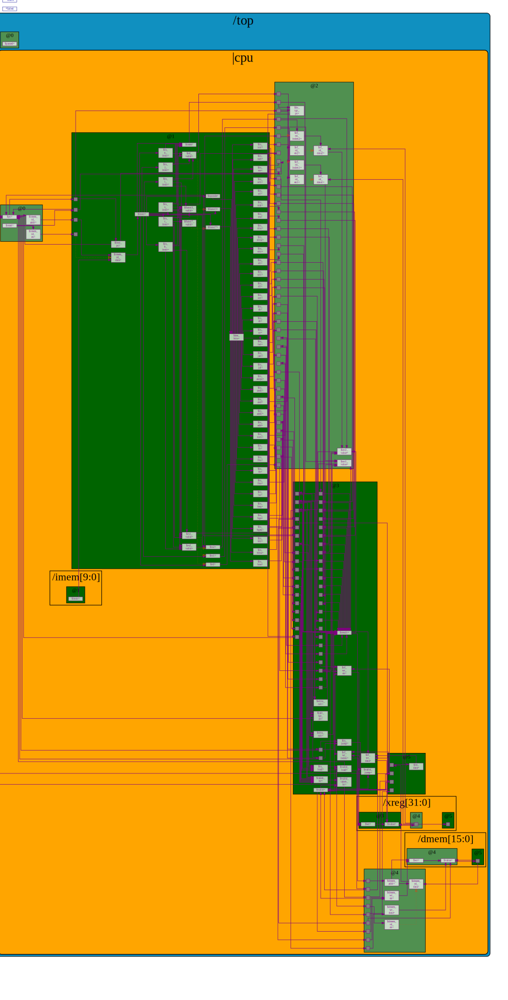
  
# Future Work
  The implemented core only support the RV32I Base Integer Instrcution Set. The design will further be modified for adding supports for all other operations and extensions like C, M, F.
  
  The decompress and decode logic for RV32C (extension C) is already been added to the design. The code can be found [here](Day3_5/riscv_core_with_compressed_instructions.tlv)

# References
  - RISC-V ISA User Manual https://github.com/riscv/riscv-isa-manual/

# Acknowledgement
