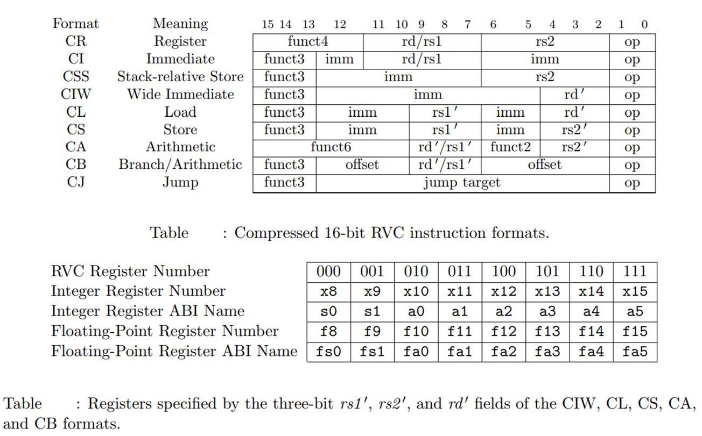
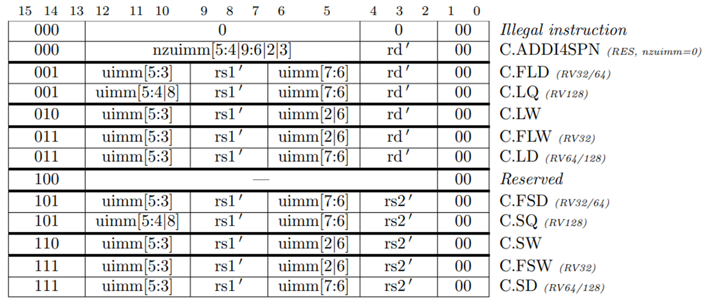
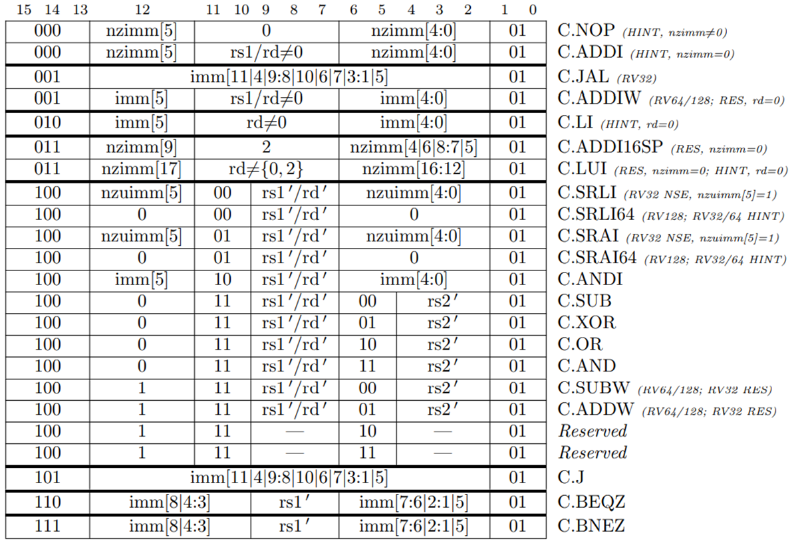
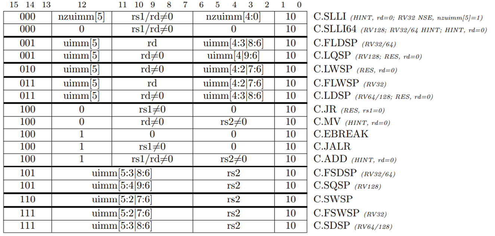

# 4-stage RISC-V Core (RVC)
  - This repository contains the logic for decompression of a compressed 16-bit instruction used in the RISC-V extension 'C', also known as RVC.
  - It is developed in [TL-Verilog](http://tl-x.org/) using [Makerchip](https://makerchip.com/).
  - To be verify the decompression and decoder logic, inputs instruction were provided to the logic manually.
  
# Compressed Instructions
 - RISC-V supports an extension to	reduces static and dynamic code size by adding short 16-bit instruction encodings for common operations. 
 - Each compressed 16-bit instruction can also be represented as an equivalent 32-bit instruction.
 - Below mentioned are all the 16-bit compressed instruction formats for RISC-V ISA:
 
   
   
 - Further, a bit pattern ending in 11 indicates a 32-bit instruction. The other bit patterns (00, 01, 10) indicate a compressed instruction. This is for convention refered to as quadrant 0, quadrant 1 and quadrant 2.
 - Each quadrant a set of fixed instructions defined in it. Below images show the quadrants and the instructions available in it.
   
   ## Quadrant 0
   
   
   ## Quadrant 1
   

   ## Quadrant 2
   

# Source
  - RISC-V ISA Manual: https://github.com/riscv/riscv-isa-manual/
